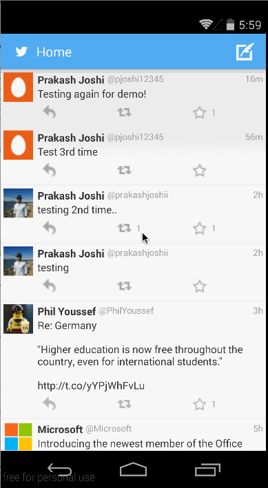

Twitter Client
============

Description:
------------
Create simple Twitter client, using Twitter REST APIs

User Stories Completed:
-----------------------

### Core Stories:
* [x] Show user's home timeline
* [x] Show tweet info like name, screen name, tweet text
* [x] Show retweet and favorite count
* [x] Added simple code to show relative timestamp like twitter
* [x] Infinite pagination
* [x] Compose tweet
* [x] Post tweet, after post go to timeline and show tweet sent as first tweet

### Optional Advanced Stories:
* [x] Pull down to refresh timeline
* [x] Efforts to make theme similar to twitter
* [x] Compose is done on DialogFragment

Demo GIF 1:
-----------

Twitter Client 2
============

Hours to implement: 10 hrs

Description:
------------
Enhance existing Twitter client to show user profile, mentions etc

User Stories Completed:
-----------------------

### Core Stories:
* [x] Show user's home timeline
* [x] Show user's mentions
* [x] Show user profile
* [x] Profile of other user on click on their profile pic
* [x] Infinite pagination of timelines or including other users

### Optional Advanced Stories:
* [x] Indeterminate progress indicator in action bar
* [x] Show multiphoto tweet with the help of list view adapter for different type (showing two one and two photos)

Demo GIF 2:
-----------

